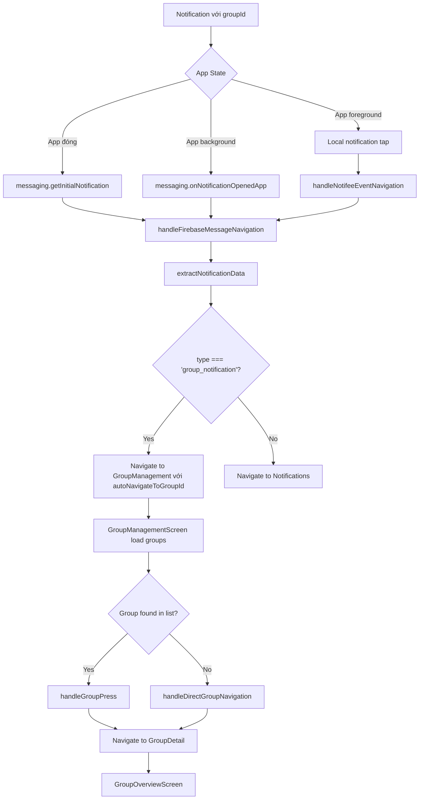

# Notification Group Navigation Guide

## 🎯 **Tính năng**

Tự động điều hướng từ notification có `groupId` đến màn hình **GroupManagementScreen** và tự động vào **GroupOverviewScreen** của group tương ứng.

## 📱 **Flow hoạt động**



## 🔧 **Cấu trúc Notification Data**

### **Ví dụ notification data từ Firebase:**
```json
{
  "notification": {
    "title": "New Transaction",
    "body": "Cường Nguyễn Mạnh added a new expense transaction: 123456 VND in Nhóm gia đính"
  },
  "data": {
    "senderUserId": "48",
    "senderUserName": "Cường Nguyễn Mạnh", 
    "groupId": "8",
    "type": "group_notification"
  }
}
```

### **Các trường data quan trọng:**
- **`groupId`**: ID của group cần navigate đến
- **`type`**: Loại notification (`"group_notification"`)
- **`senderUserName`**: Tên người gửi (optional, dùng làm fallback groupName)

## 📂 **Files được modify**

### **1. `navigation/types.ts`**
```typescript
GroupManagement: { 
  autoNavigateToGroupId?: string; 
  groupName?: string; 
} | undefined;
```

### **2. `utils/notificationNavigationUtils.ts`** (Mới)
- `handleNotificationNavigation()`: Xử lý navigation từ notification data
- `extractNotificationData()`: Extract data từ different notification sources
- `handleFirebaseMessageNavigation()`: Handle Firebase messages
- `handleNotifeeEventNavigation()`: Handle local notification events

### **3. `screens/GroupManagementScreen.tsx`**
- Thêm `route.params` để nhận `autoNavigateToGroupId`
- Auto-navigation logic trong `useEffect`
- `handleDirectGroupNavigation()`: Load group detail trực tiếp nếu không tìm thấy trong list

### **4. `app/_layout.tsx`**
- Setup navigation ref cho notification navigation
- Modified event handlers:
  - `messaging().getInitialNotification()`
  - `messaging().onNotificationOpenedApp()`
  - `notifee.onBackgroundEvent()`

## 🚀 **Cách test**

### **Test với data mẫu:**
```javascript
// Test notification data
const testNotificationData = {
  data: {
    senderUserId: "48",
    senderUserName: "Test User",
    groupId: "8", 
    type: "group_notification"
  }
};

// Simulate notification navigation
handleNotificationNavigation(testNotificationData.data);
```

### **Các scenarios test:**

1. **App đóng hoàn toàn** → Tap notification → App mở → Auto navigate to group
2. **App chạy background** → Tap notification → App foreground → Auto navigate to group  
3. **App đang mở** → Receive notification → Tap local notification → Auto navigate to group

## 🔍 **Debugging**

### **Console logs để track:**
```
🎯 [NotificationNavigation] Handling notification data: {...}
🎯 [NotificationNavigation] Group notification detected, navigating to group: 8
✅ [NotificationNavigation] Successfully navigated to GroupManagement
🎯 [GroupManagementScreen] Auto-navigating to group: 8
✅ [GroupManagementScreen] Found target group, navigating: Group Name
🧭 [GroupManagementScreen] Navigating to GroupDetail screen from notification
```

### **Common issues:**

1. **Navigation ref not ready:**
   - Check: `✅ [NavigationContainer] Ready - Navigation ref set`
   
2. **Group không tìm thấy:**
   - Check: API response từ `getUserJoinedGroups()`
   - Fallback: `handleDirectGroupNavigation()` sẽ load group detail trực tiếp

3. **Notification data bị thiếu:**
   - Check: `extractNotificationData()` logs
   - Ensure backend gửi đúng format data

## 🎨 **UI/UX Flow**

1. **User nhận notification**: Hiển thị toast/banner với group info
2. **Tap notification**: App mở (nếu đóng) hoặc foreground (nếu background)  
3. **Auto navigation**: Seamlessly navigate đến group mà không cần user action
4. **Group detail**: Hiển thị GroupOverviewScreen với data đầy đủ
5. **Fallback**: Nếu có lỗi, navigate đến Notifications screen

## 📊 **Performance notes**

- **Navigation delay**: 1s delay cho `getInitialNotification` để đảm bảo app ready
- **Caching**: Groups được cache trong GroupManagementScreen  
- **Fallback**: Direct API call nếu group không có trong cache
- **Error handling**: Graceful fallback đến Notifications screen

## 🔧 **Future improvements**

1. **Deep linking**: Integrate với branch.io để support universal links
2. **Pre-loading**: Pre-load group data khi nhận notification
3. **Batching**: Handle multiple notifications cùng lúc
4. **Analytics**: Track notification engagement metrics
